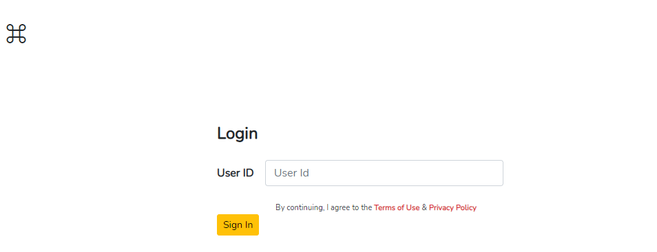
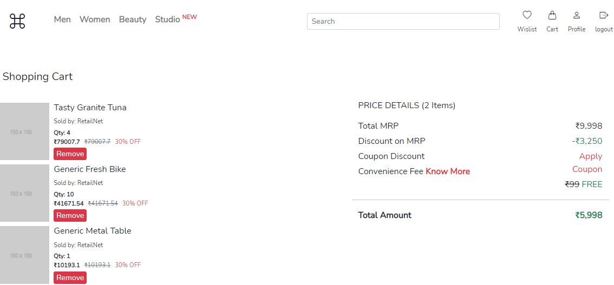
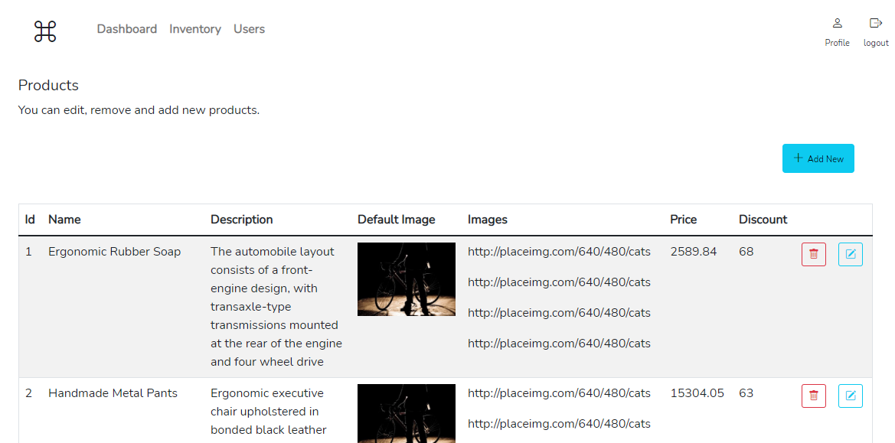
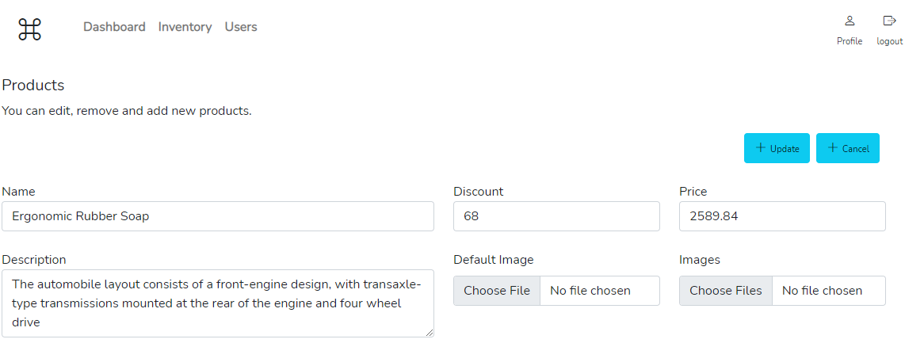
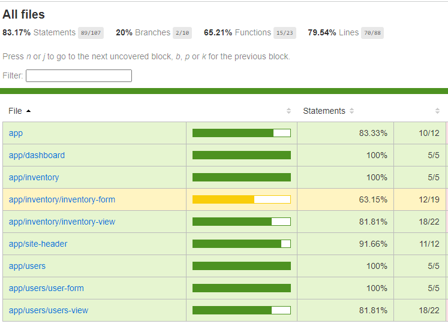
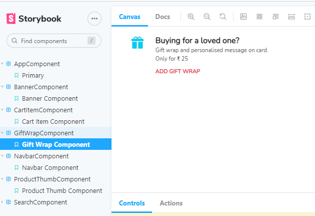

# RockBand

Features Enabled:

- Modularize App Structure
- Typescript Enabled
- Mono Repo Architecture
- Advance NgRx Store Implementation (using EntityAdapter, EntityState, etc.)
- Ng-bootstrap and Bootstrap library integration
- Advance Angular features implementation (@Inject, Token, etc)
- Custom Angular Pipe Module (ProductPipesModule) implemented
- Authentication Module Implmentation (including Auth Gard for protected routes)
- Browser Refresh Implications and implementation of PathLocationStrategy
- Custom HTTP Error Handing using HttpInterceptor
- Using environment variables for external API endpoints
- Git Actions for CI/CD Pipelines
- Code Coverage Enabled for Each Angular Modules
- Application Theme Structured
- Storybook Enabled
- Dockerize Implementation
- Web Content Accessibility Guidelines (WCAG) Compliant
- Shopping Cart Admin Panel Feature Enabled (Inventory Module Only for now)

### Login Module Layout

### Product Module Layout

### Cart Module Layout

---

### Project Script Guide:

Navigate to `Frontend-Starter\BE` folder for Backend Mock Services

- Run Development Environment
  - `yarn start`

Navigate to `Frontend-Starter\FE\rock-band` folder for Angular Application

- Setup Application
  - `yarn install`
- Run Retail Customer Application
  - `yarn rock:dev`
  - Once server up, browse the site on http://localhost:4100
- Run Admin Application
  - `yarn radmin:dev`
  - Once server up, browse the site on http://localhost:4200
- Run Storybook
  - `yarn rock:storybook`
- Run Tests for Retail Customer Application
  - `yarn rock:test`
  - `yarn rock:cart:test`
  - `yarn rock:product:test`
- View Code Coverage of the Retail Customer Application
  - `yarn rock:cc`
  - `yarn rock:cart:cc`
  - `yarn rock:product:cc`
- Run Tests for Admin Application
  - `yarn radmin:test`
- View Code Coverage of the Admin Application
  - `radmin:cc`
- Run Lint and Prettier
  - `yarn rock:lint`
  - `yarn rock:format`

### Module-wise Error Handing

### Code Coverage Report

### Lighthouse Report

### Admin - Inventory Module Layout

### Admin - Inventory Edit Product Layout

### Admin - Code Coverage

### Storybook Feature

This project was generated using [Nx](https://nx.dev).
